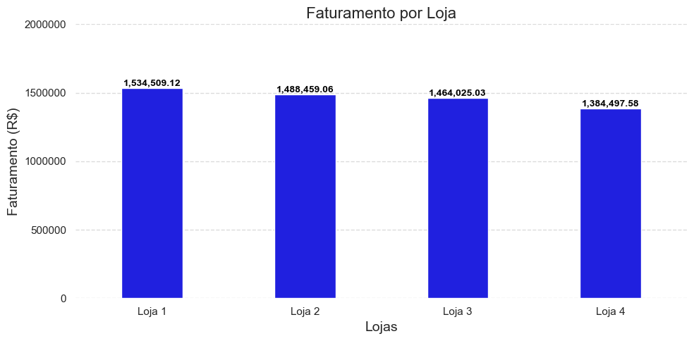
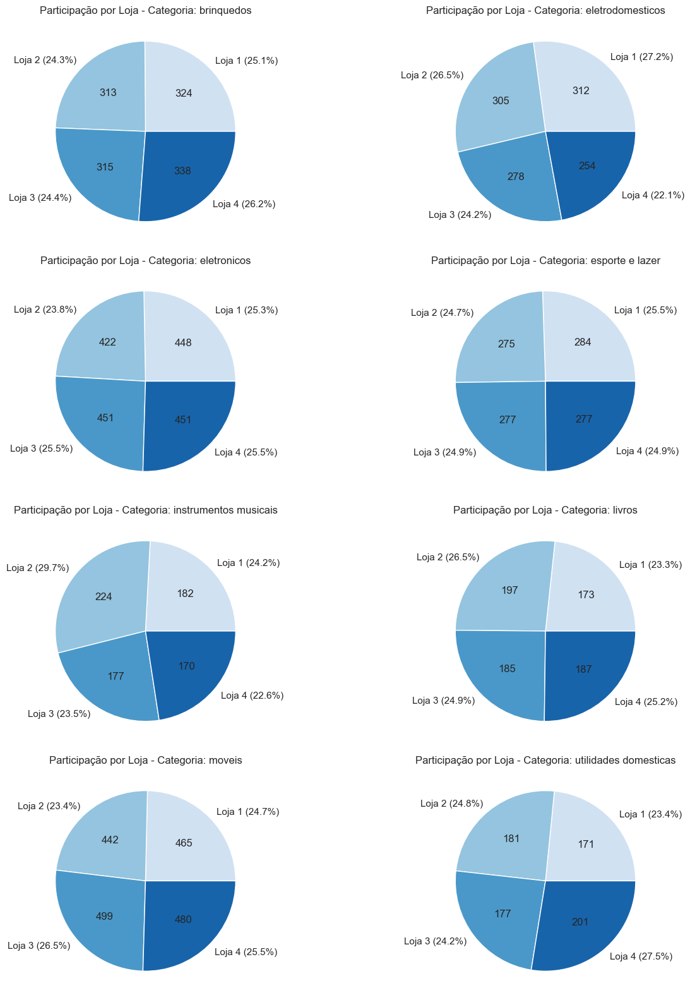
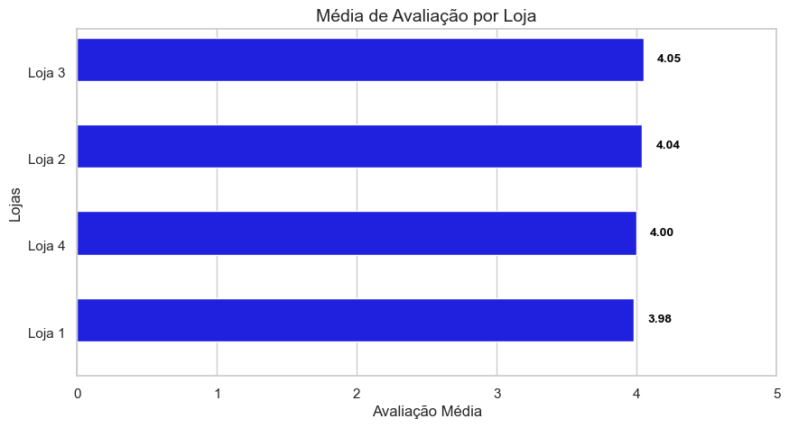
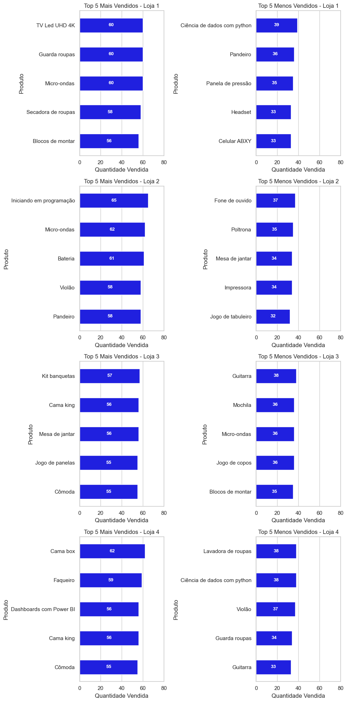
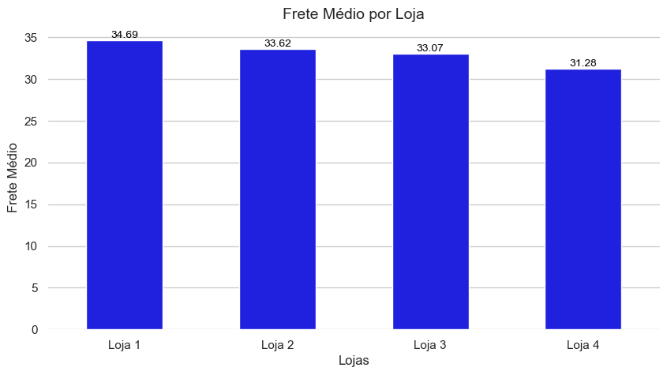

# Challenge Alura Store 

Este repositório faz parte do primeiro Challenge do programa Oracle One Data Science G8 e consiste em ajudar o Senhor João a decidir qual loja da sua rede Alura Store vender para iniciar um novo empreendimento. Para isso, é necessário analisar dados de vendas, desempenho e avaliações das 4 lojas fictícias da Alura Store. O objetivo é identificar a loja com menor eficiência e apresentar uma recomendação final baseada nos dados.

---

## 📋 Sumário

1. [Descrição do Projeto](#descricao-do-projeto)

2. [Estrutura de Diretórios](#estrutura-de-diretorios)

3. [Pré-requisitos](#pre-requisitos)

4. [Instalação](#instalacao)

5. [Uso / Como Executar](#uso-como-executar)

6. [Executando no Google Colab](#executando-no-google-colab)

7. [Análises Contidas](#analises-contidas)

8. [Resultados e Insights](#resultados-e-insights)

9. [Contribuindo](#contribuindo)

10. [Licença](#licenca)

---

## 📝 Descrição do Projeto

Neste desafio, utilizei um notebook para:

- Calcular e comparar o faturamento total de cada loja.

- Avaliar a média de avaliações dos clientes por loja.

- Mensurar o frete médio e sua influência na rentabilidade.

- Identificar os Top 5 produtos mais e menos vendidos por unidade.

> Com base nesses resultados, recomendo qual loja vender e exploro padrões geográficos que impactam o desempenho.

---
## 📂 Estrutura de Diretórios

├── data/
│   ├── loja_1.csv
│   ├── loja_2.csv
│   ├── loja_3.csv
│   └── loja_4.csv
│
├── notebooks/
│   └── AluraStoreBr.ipynb       # Notebook de análise completo
│
└── README.md                   # Este arquivo

---

## ⚙️ Pré-requisitos

Python 3.8+

Bibliotecas Python:

- pandas

- numpy

- matplotlib

- seaborn
---

## 🚀 Instalação

Clone este repositório:

`git clone https://github.com/muller-pereira/alura_store.git`

Instale as dependências:

`pip install pandas numpy matplotlib seaborn`

Certifique-se de que os arquivos CSV de cada loja estejam em `data/`.

---

## 🎯 Uso / Como Executar (Local)

Abrir e executar o Notebook

Abra o Jupyter Notebook ou JupyterLab no diretório do projeto:

jupyter notebook

No navegador, clique em `notebooks/AluraStoreBr.ipynb`.

Execute as células na ordem, da primeira à última.

Isso irá gerar:

Gráficos e tabelas de faturamento, avaliação e frete.

Top 5 e Bottom 5 de produtos vendidos por loja.

---

## 🛰️ Executando no Google Colab

Acesse [`https://colab.research.google.com/`](https://colab.research.google.com/) e faça login.

Selecione GitHub e cole a URL do repositório:

[`https://github.com/muller-pereira/alura_store.git`](https://github.com/muller-pereira/alura_store.git)

Abra o notebook `notebooks/AluraStoreBr.ipynb`.

No início do notebook, instale as bibliotecas:

> `!pip install pandas numpy matplotlib seaborn folium`

(Opcional) Monte seu Google Drive:

>`from google.colab import drive`

> `drive.mount('/content/drive')`

Ajuste os caminhos dos CSVs se necessário:

>`import pandas as pd`

>`df1 = pd.read_csv('data/loja_1.csv')  # ou /content/drive/MyDrive/...`

Execute todas as células para gerar as análise.

---

## 📊 Análises Contidas

- Faturamento por Loja

- Vendas por Categoria

- Avaliação Média

- Top/Bottom 5 Produtos

- Frete Médio

---

## 🔍 Resultados e Insights Principais

A Loja 4 é a que tem o menor faturamento (cerca de R$ 1,38 M), ou seja, gera menos receita do que qualquer outra. Além disso:

- Apresenta avaliação média de clientes ligeiramente inferior ao das demais.

- Tem custo de frete médio parecido ou até um pouco maior em relação ao que fatura, reduzindo sua “eficiência” de operação (menos receita gerada por real investido em frete).

- Nas análises de top/menos vendidos, seus principais itens (cama box, faqueiro) não alcançam nem de longe os picos de giro vistos em lojas especializadas (como móveis na Loja 3 ou cursos na Loja 2).

> Em conjunto, isso indica que a Loja 4 é a menos eficiente do ponto de vista de retorno sobre estoque, logística e satisfação do cliente.
---

## 🤝 Contribuindo

- Fork este repositório

- Crie branch: `git checkout -b feat/sua-analise`

- Commit: `git commit -m "feat: descrição da sua análise"`

- Push e abra um Pull Request
---

## ⚖️ Licença

Licenciado sob MIT License — consulte LICENSE.

---
Challenge Alura Store - Desenvolvido para o programa Oracle One Data Science G8 

---